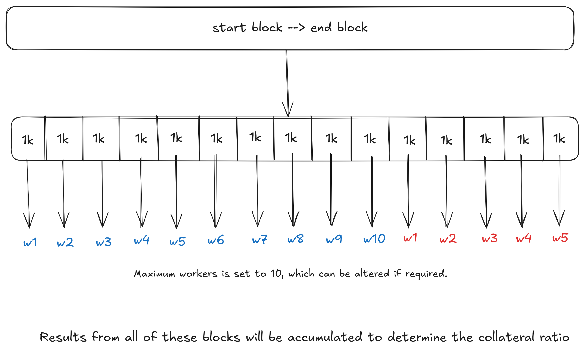

> [!WARNING]
> This repository has been deprecated. Please contact us at <support@multipli.fi> to gain access to the new repository.

# Multipli Collateral Validator

<p align="center">
  
</p>

## Overview

This repository holds the underlying code through which multiple validators push the validated data result to the
public contract, thus enabling transparency on the funds entrusted with Multipli. The codebase is loosely coupled with
FastAPI framework such that API functionalities can be incorporated if need be. The service employs multiple strategies
to calculate the collateral ratio and submit transactions (carrying validator data) periodically. More detailed 
information can be found in the following sections.

## Getting Started

### Clone the Repository

First, clone the repository to your local machine. Ensure you have a `.env` file at the root level of the repository.

```bash
git clone https://github.com/multipli-libs/multipli-collateral-validator.git
```
Make sure to add `.env` file to the root directory of the service. If you do not have one, please contact us at [support@multipli.fi](mailto:support@multipli.fi). 


### Docker Compose

Navigate to the production directory and run the deployment script to get the Docker instance up and running.

```bash
cd multipli-collateral-validator/Build/Production/
bash deploy.sh
```

By default, transactions are pushed to the public contract every 8 hours with the selected strategy in the `.env` file

## Overview of Strategies Available

Multipli Collateral Validator service uses different strategies to calculate the collateral ratio, and publish the evaluated values to the
blockchain to ensure data credibility and transparency. (By default, the service calculates and publishes data every 8 
hours, which can be customized as required)

### API Strategy

In this strategy, we fetch the TVL from Binance and TVL from Multipli API and compare them to calculate the Collateral
Ratio using this approach

$$
\text{Collateral Ratio Percentage} = \frac{\text{TVL on Yield Generating Platform (Binance)}}{\text{TVL response from Multipli API}} \times 100\%
$$

This approach is simple, fast and not resource intensive. The entrypoint to run this strategy is available in `strategies/api_strategy.py` 
file

### Crawler Strategy

In this strategy, we fetch the TVL from Binance and calculate TVL by crawling the chains to compare them for determining 
the Collateral Ratio using this method.

$$
\text{Collateral Ratio Percentage} = \frac{\text{TVL on Yield Generating Platform (Binance)}}{\text{TVL calculated by crawling the blockchain}} \times 100\%
$$

This approach is time and resource intensive but would definitely be a reliable source of truth. The entrypoint to run 
this strategy is available in `strategies/crawler_strategy.py` file

### Hybrid Strategy

In this strategy, we fetch the TVL from Binance, obtain TVL values by crawling the blockchain and using the Multipli API. 
We determine the maximum TVL between the Multipli API and the blockchain crawler, then calculate the Collateral Ratio using this maximum value.

$$
\text{Maximum TVL} = \max(\text{TVL response from Multipli API}, \text{TVL calculated by crawling the blockchain})
$$

$$
\text{Collateral Ratio} = \frac{\text{TVL on Yield Generating Platform (Binance)}}{\text{Maximum TVL}} \times 100\%
$$

This approach is technically the best of both strategies. The entrypoint to run this strategy is available in `strategies/hybrid_strategy.py` file

## Project at a Glance

The entry point for the application is `main.py` where we schedule the transactions to be made every 8 hours. The
scheduling details and configuration can be viewed in `workers` directory. The `cron_scheduler` runs a utility service which
takes care of fetching the validator data and making a transaction for the same. This utility, `collateral_data_utility.py`
available under `utilities` directory also makes sure that only one transaction is made from the wallet address in a period
of 8 hours, thus maintaining equal importance of data sent by every validator.

### Crawlers

Currently, Multipli is accepting funds through two networks on Mainnet: `Ethereum Network` and `Binance Smart Chain Network`.
To get the current volume of tokens held by Multipli, one could subtract the total withdrawals from total deposits 
transferred through the public contract since the launch of the  Multipli mainnet. This involves looking through 
thousands of blocks of data, and the number would only increase with time. To make this system efficient, multiple workers are acquired
through Threadpool and each worker is made to crawl through a certain range of blocks. Thus, providing a way to parallely 
compute multiple blocks.

<p align="center">
  
</p>

The crawler logic can be found in `utilities/crawlers/chain_crawler_base_utility.py` file. Both, Binance Smart Chain and Ethereum
networks use this as a base class to fetch all events required for calculating TVL


### Environment variables 

- `BINANCE_ACCOUNT_1_API_KEY`: API Key for Binance account handling funds (4 API Keys)
- `BINANCE_ACCOUNT_1_API_SECRET`: API Key for Binance account handling funds (4 API Secrets)
- `MULTIPLI_API_KEY`: API Key through which Multipli API can be accessed
- `WALLET_ADDRESS`: Wallet Address of the Validator through which validator data will be pushed to blockchian as a transaction
- `WALLET_PRIVATE_KEY`: Private Key of the Validator's wallet through which validator data will be pushed to blockchian as a transaction
- `ETHEREUM_HTTP_PROVIDER`: API service through which RPC calls are made to Ethereum blockchain network
- `BNB_HTTP_PROVIDER`: API service through which RPC calls are made to Binance Smart Chain blockchain network
- `AVALANCHE_HTTP_PROVIDER`: API service through which RPC calls are made to Avalanche blockchain network
- `STRATEGY`: Strategy to be employed by the Validator can be chosen from any of these three options: `CRAWLER`, `API`, `HYBRID`
- `ENABLE_BSC_TO_PUSH_DATA`: Set this value to 1, if you would like data to be pushed to Binance Smart Chain Network
- `ENABLE_AVALANCHE_TO_PUSH_DATA`: Set this value to 1, if you would like data to be pushed to Avalanche Network

> When choosing HTTP Providers, it is recommended to use [Alchemy Services](https://www.alchemy.com/) for optimal and faster results

> If you are an institutional user, the transactions made would not be visible through the public contract, kindly update
> the environment variables and use API strategy for accurate results. Kindly contact us at [support@multipli.fi](mailto:support@multipli.fi) 
> for more information or additional support.

### Copyright

```
Copyright 2025 Multipli.fi

Licensed under the Apache License, Version 2.0 (the "License").
You may not use this file except in compliance with the License.
You may obtain a copy of the License at

    http://www.apache.org/licenses/LICENSE-2.0

Unless required by applicable law or agreed to in writing, software
distributed under the License is distributed on an "AS IS" BASIS,
WITHOUT WARRANTIES OR CONDITIONS OF ANY KIND, either express or implied.
See the License for the specific language governing permissions and
limitations under the License.

```

### Operational Use Policy

**IMPORTANT:**

Participants running a Multipli Collateral validator node **must not in any circumstances modify or alter (whether by additon, deletion, substitution or otherwise) any part of the code or any configuration values** within the provided repository. Validators are required to run the software **exactly as provided**, without any modification or alterations. This is critical to ensure uniformity, integrity, consistency, and trust in the validator network.

Any questions or clarifications or any suggested changes should be sent in writing to support@multipli.fi for consideration by the administrator. Only changes approved by the administrator will be carried out in the Multipli Collateral Validator repository.

**Any unauthorized changes by any validator to the code or any of the parameters will result in immediate disqualification from the Validator network and strict penalties and legal action will be taken against any violators.**
